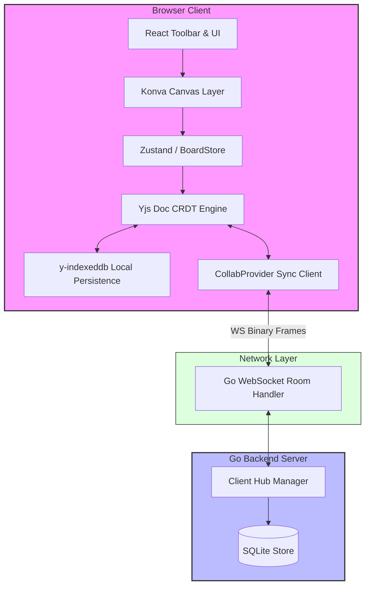
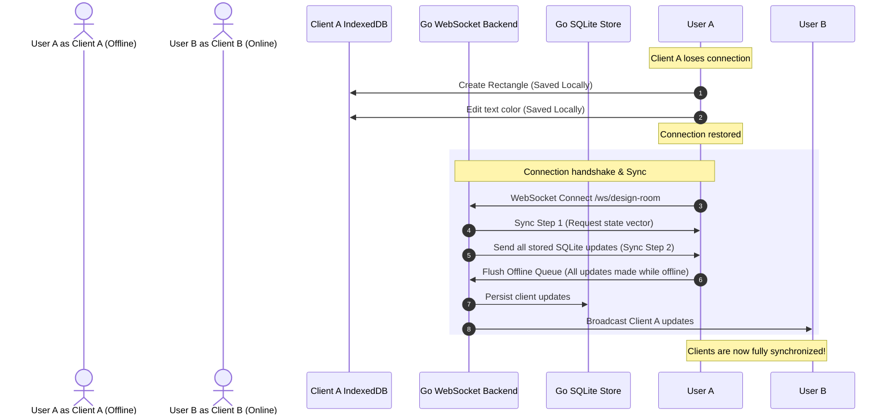

# CollabBoard

A production-grade, collaborative infinite whiteboard application. Multiple users collaborate in real time on an infinite canvas using **CRDTs (Conflict-free Replicated Data Types)** to guarantee eventual consistency without using naive WebSocket state-replacement broadcasting. It functions completely offline and synchronizes automatically on reconnection.

---

## Architecture Diagram



---

## CRDT Explanation

### 1. Replicated Growable Array (RGA)
RGA is used by Yjs to implement ordered lists of elements (e.g., shape rendering order/layers). In naive arrays, inserting an element at index `i` concurrently from Client A and Client B results in indices shifting, leading to inconsistent orderings. RGA represents elements as a linked list where every item has a unique logical identifier (e.g. `(ClientID, SequenceNumber)`). When elements are concurrently added, Yjs compares client IDs to deterministically order siblings, guaranteeing all clients merge the sequence identically.

### 2. Last-Write-Wins (LWW) Register
LWW Registers are used for attributes of elements (e.g., color, coordinates, width, text content). Each element attribute is stored with a logical timestamp (or transaction count). When concurrent modifications occur, the update with the highest logical timestamp wins. If timestamps match, the client with the higher `ClientID` wins.

### 3. Vector Clocks & State Vectors
Vector Clocks map Client IDs to their maximum processed transaction sequence numbers: `[ClientA: 12, ClientB: 5]`.
In Yjs, this is called a **State Vector**.
- **Sync Step 1**: When connecting, a client sends its State Vector to the server.
- **Sync Step 2**: The receiver compares this State Vector with its local data and generates a minimal binary diff (all updates that the sender has not yet seen).

### 4. Awareness Protocol
Ephemeral states (such as mouse coordinates, selection bounding boxes, and active typing indicators) do not require persistent storage. Yjs uses an out-of-band **Awareness Protocol** where ephemeral states are broadcasted to all connected clients and are automatically cleaned up when a client disconnects or becomes inactive (using heartbeats).

---

## Sequence & Offline Sync Diagram



---

## Tech Stack
- **Frontend**: React, TypeScript, Vite, Canvas API, Konva.js, TailwindCSS.
- **CRDT / Storage**: Yjs, y-indexeddb (IndexedDB wrapper).
- **Backend**: Go (Golang), WebSockets (`github.com/gorilla/websocket`), SQLite (`modernc.org/sqlite` pure Go driver).

---

## Project Structure
- `/backend`: The Go room coordinator server and storage manager.
- `/frontend`: The React Infinite Canvas interface built with Konva.

---

## Setup & Running the Application

### 1. Start the Go Backend
Ensure you have Go installed, then run:
```bash
cd backend
go run cmd/server/main.go
```
The server will start listening on `http://localhost:8080`.

### 2. Start the Frontend Dev Server
Ensure you have Node.js installed, then run:
```bash
cd frontend
npm install
npm run dev
```
Open `http://localhost:5173` in multiple browser windows to test real-time collaboration.

---

## Tradeoffs & Decisions

| Feature / Pattern | Choice | Reason | Trade-off |
| :--- | :--- | :--- | :--- |
| **Real-time Engine** | Yjs CRDT | Solves structural sync conflicts (like orderings) mathematically. | Slightly larger bundle size and memory usage. |
| **Canvas Renderer** | Konva.js | High performance canvas wrapper with node selectors and culling. | Heavy dependency compared to raw 2D Canvas context. |
| **Offline DB** | IndexedDB | High-capacity browser storage for binary blobs. | Slower load times for extremely large whiteboards. |
| **Backend Driver** | Pure Go SQLite | Eliminates CGO compile dependencies on Windows/macOS/Linux. | Minor write speed penalty compared to native C CGO SQLite. |

---

## System Design Interview Questions
1. **How do you scale this WebSocket backend to millions of active rooms?**
   - *Answer*: Introduce a Redis Pub/Sub backplane. Distribute rooms across multiple WebSocket server nodes using a consistent hashing ring. When a client publishes a CRDT update, the handler broadcasts it via Redis to all server nodes holding active connections for that room.
2. **How does Yjs prevent state vectors from growing infinitely?**
   - *Answer*: Yjs groups contiguous update blocks from the same client into single structs, pruning deleted metadata and maintaining compact state arrays.
